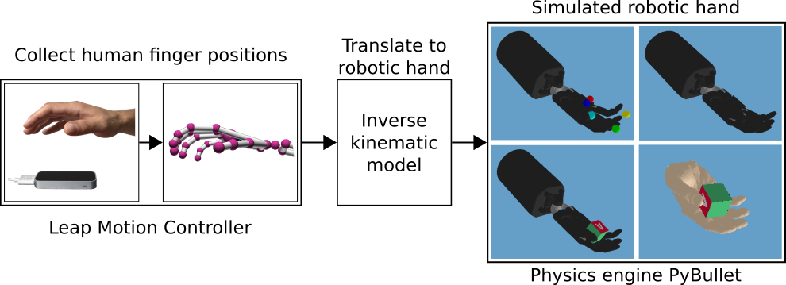

# Teleoperation System for Teaching Dexterous Manipulation

This teleoperation system utilizes the [Leap Motion Controller](https://www.ultraleap.com/product/leap-motion-controller/) as an optical hand tracking sensor and [PyBullet](https://github.com/bulletphysics/bullet3) as physics engine. The system can control a simulated model of the [Shadow Dexterous Hand](https://www.shadowrobot.com/products/dexterous-hand/) as well as a visualization of the humanoid [CyberGlove](http://wiki.ros.org/asr_cyberglove_visualization).

The Shadow Dexterous Hand is an anthropomorphic robotic hand with 24 joints whereof 20 can be controlled independently and 4 are coupled joints.

The hand pose is detected by the Leap Motion sensor. An inverse kinematic model, based on the Shadow Dexterous Hand, is used to convert human finger positions to robot joint positions to control the robotic hand in simulation. The model is derived with the Denavit-Hartenberg formalism, considering the retrievable data from the Leap Motion Controller. Due to the complexity of a single model, it is subdivided into a total of six smaller models, one for each finger and one for the wrist. To ensure the independence of the hand’s pose in the sensor’s field of view, the human finger positions are retrieved relatively to the hand-palm position.

## Teleoperation System

Further information considering the teleoperation system, as well as a standalone version, is available in the `leap_motion` directory.

## Gym environments

A set of two OpenAI [Gym](https://github.com/openai/gym) compatible environments based on the Shadow Dexterous Hand simulated in PyBullet and trained with [Stable Baselines](https://github.com/hill-a/stable-baselines).

The tasks are reaching different target fingertip positions and in-hand object manipulation of a block. The teleoperaton system is utilized to record human expert datasets for both tasks and pre-train a policy using behaviour cloning. For more information see the `gym_environments` directory.