# Gym Environments

## Content

* [Environments](#environments)
    * [Shadow Hand Reach](#shadow-hand-reach)
    * [Record expert dataset and Behaviour Cloning](#record-expert-dataset-and-behaviour-cloning)
    * [Shadow Hand Block](#shadow-hand-block)
* [Usage](#usage)
* [File Structure](#file-structure)

## Environments

Both environments are based on the Shadow Dexterous Hand and utilize PyBullet as physics simulator.
The two developed tasks are reaching a target position and in-hand object manipulation of a block.

The Actions of both tasks are 20-dimensional regarding the absolute positions of all non-coupled joints (24 joints in total, whereof 20 are non-coupled).

Both tasks can operate with dense rewards, or with sparse rewards. This gives the possibility to switch between a signal of the negative distance to the goal and a robotic approach of success or failure.

## Shadow Hand Reach 

A simple task, where the goal is achieved if the mean-value over the sum of all distances between the fingertips and the desired positions is less than 1 cm. The goal is 15-dimensional and consists of the target Cartesian positions.

Observations contain the 20 positions and velocities of the hand joints as well as the Cartesian coordinates of all fingertips (current position and target) for the reach task (70-dimensional). Considering the [gym.GoalEnv](https://github.com/openai/gym/blob/3394e245727c1ae6851b504a50ba77c73cd4c65b/gym/core.py#L160), needed to train with [HER](https://stable-baselines.readthedocs.io/en/master/modules/her.html), the observations additionally contain the `achieved_goal` field which adds another 15 dimensions to the observations.

Actions and successes are applied/evaluated differently for the 2 available versions `v0` and `v1`.

shadow_hand_reach-v0 | shadow_hand_reach-v1
:--- | :---
Actions are applied for a single simulation step with a step frequency of 100Hz. | A single action is applied for 10 simulation steps for one trainings step with a step frequency of 240Hz.
Uses the default position gain to move the simulated joints. | Position gain is set to value of 0.02.
Success and episode reset, as soon as the goal is reached. Maximum episode steps is 1000 for experiment 1 and 100 for experiment 2. | Fixed episode length of 100 steps. This forces the hand to hold the desired position until the episode is over. Success based on the amount of steps within the threshold per episode.

### Experiment 1

In experiment 1 the `shadow_hand_reach-v0` environment is trained for a total of 3e6 timesteps. The training is repeated 5 times, each with different predefined seeds (19-23).
The depicted results are the median reward, the median success rate and the corresponding interquartile range, evaluated on these experiments.
  
Reward | Success
:---:|:---:
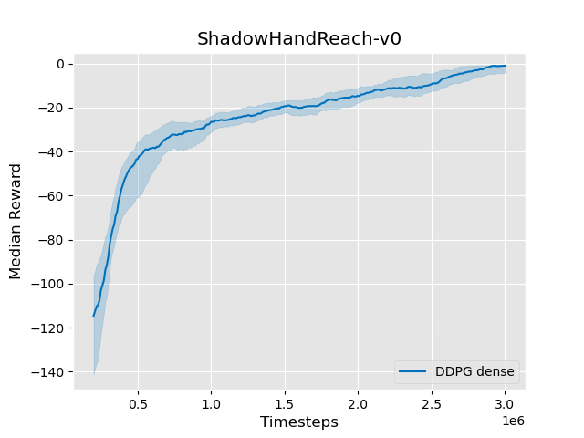 | 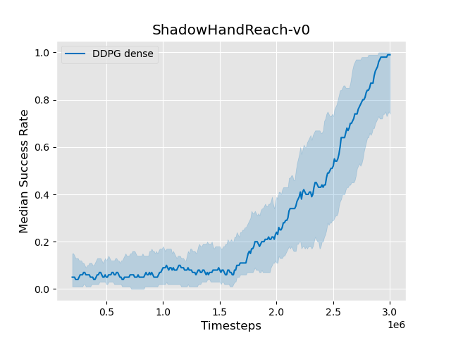

#### Visualized agents

Untrained | Trained (DDPG dense)
:---:|:---:
 | 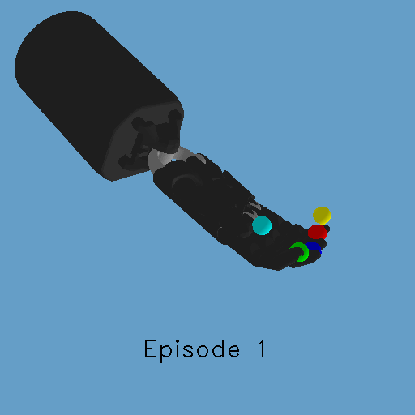

#### Hyperparameters

The `shadow_hand_reach-v0` experiment 1 uses the following hyperparameters for [DDPG](https://stable-baselines.readthedocs.io/en/master/modules/ddpg.html):

| Hyperparam | Value| Hyperparam | Value| 
| :--------- | :--- | :--------- | :--- |
| Policy | Actor and critic using a MLP (2 layers of 64) | Buffer size | 1e6 transitions | 
| Discount factor (gamma) | 0.95 | Random exploration | 0 | 
| Soft update coefficient (tau) | 0.001 | Train steps | 50 | 
| Batch size | 256 | Rollout steps | 100 | 
| Critic output normalized | False | Eval steps | 100 | 
| Actor Optimizer | Adam | Noise type | normal |
| Actor learning rate | 1e-4 | Noise standard deviation | 0.22 |
| Critic Optimizer | Adam | Param noise interval | 50 (steps) |
| Critic learning rate | 1e-3 | Observation clipping | [-5.0, 5.0] |
| Total training steps | 3e6 | | |

#### Environment parameters

The `shadow_hand_reach-v0` experiment 1 uses the following parameters for the environment:

| Hyperparam | Value| Hyperparam | Value| 
| :--------- | :--- | :--------- | :--- |
| distance_threshold | 0.01 | reward_type | dense | 
| max_steps_per_episode | 1000 | position_gain | default (comment out) | 
| couple_factor | None | sim_time_step | 1 / 100 | 
| sim_frames_skip | 1 | sim_n_sub_steps | 1 | 

### Experiment 2

For the second `shadow_hand_reach-v0` experiment the following parameters are used (changed to more realistic parameters according to the movement of the robotic hand). Again it is trained with DDPG.

#### Visualized agents

Untrained | Trained (DDPG dense) 
:---:|:---:
 | 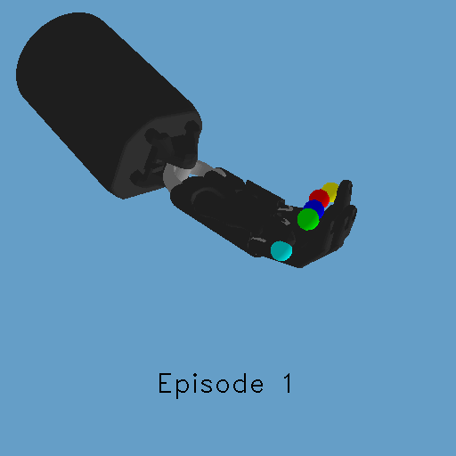 

#### Hyperparameters

| Hyperparam | Value| Hyperparam | Value| 
| :--------- | :--- | :--------- | :--- |
| Policy | Actor and critic using a MLP (2 layers of 64) | Buffer size | 1e6 transitions | 
| Discount factor (gamma) | 0.95 | Random exploration | 0 | 
| Soft update coefficient (tau) | 0.001 | Train steps | 50 | 
| Batch size | 256 | Rollout steps | 100 | 
| Critic output normalized | False | Eval steps | 100 | 
| Actor Optimizer | Adam | Noise type | normal |
| Actor learning rate | 1e-3 | Noise standard deviation | 0.22 |
| Critic Optimizer | Adam | Param noise interval | 50 (steps) |
| Critic learning rate | 1e-3 | Observation clipping | [-5.0, 5.0] |
| Total training steps | 3e6 | | |

#### Environment parameters

| Hyperparam | Value| Hyperparam | Value| 
| :--------- | :--- | :--------- | :--- |
| distance_threshold | 0.01 | reward_type | dense | 
| max_steps_per_episode | 100 | position_gain | 0.02 | 
| couple_factor | None | sim_time_step | 1 / 240 | 
| sim_frames_skip | 10 | sim_n_sub_steps | 1 | 

## Record expert dataset and Behaviour Cloning

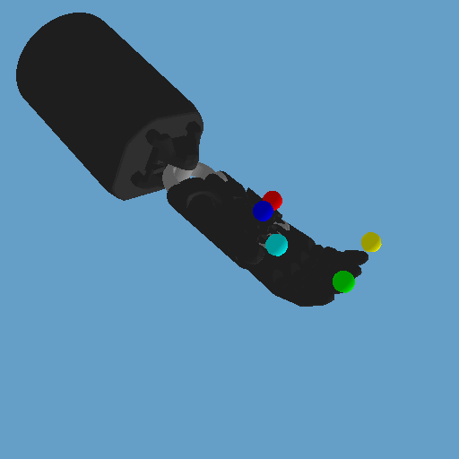

In order to accelerate the training process, behaviour cloning is introduced. This can also be considered as supervised learning. The reinforcement learning policy is pre-trained on trajectories (observation-action pairs) from an expert. Actions taken by the expert, according to a given observation, must be reproduced by the policy.

The expert trajectories are recorded on the very same environment utilizing the proposed teleoperation system to control the Shadow Dexterous Hand. Each trajectory starts at the environment reset and ends when the goal is reached. The expert dataset (=set of trajectories) is stored in a dictionary with the keys shown below and saved as a numpy archive.

```
behaviour_cloning_dict = {
    "actions": actions,
    "obs": observations,
    "rewards": rewards,
    "episode_returns": episode_returns,
    "episode_starts": episode_starts
}
```

During the pretraining a train validation split of 0.7 (70% training-data) is used.

### Experiment 1

In the first `shadow_hand_reach-v0` experiment the RL policy is pre-trained on a set of 100 trajectories for a fixed amount of iterations (1e3). The depicted figures show the median reward and success rate, as well as the loss during pre-training.

The pre-trained policy manages to outperform its untrained counterpart in terms of required timesteps to successfully learn the task by almost 33% (pre-trained: 2e10, normal: 3e10 timesteps). 

| Reward | Success | Pre-training
:---:|:---:|:---:
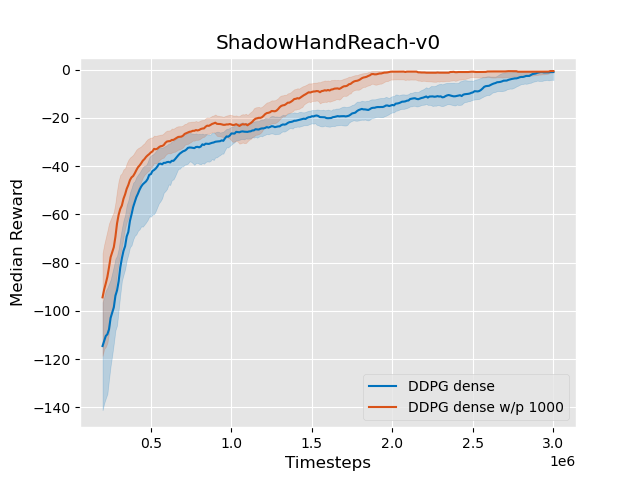 | 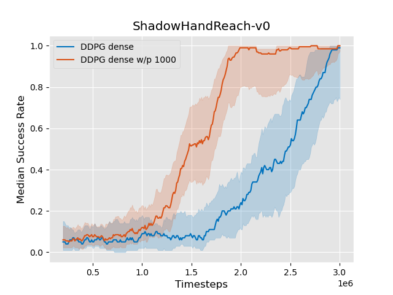 | 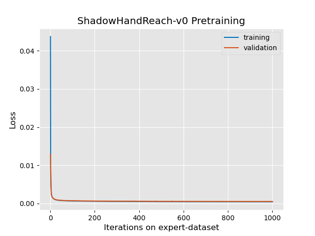|

### Experiment 2

In the second experiment, the policy is pre-trained on a set of 25 trajectories for 100 iterations. 

| Reward | Success | Pre-training
:---:|:---:|:---:
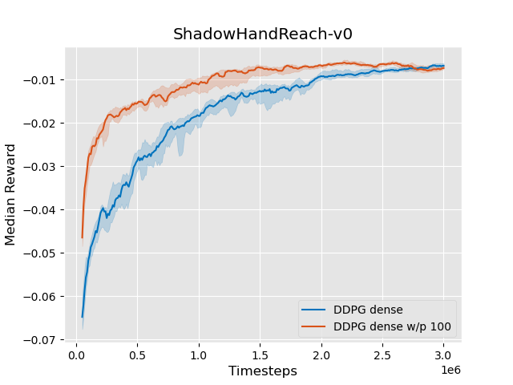 | 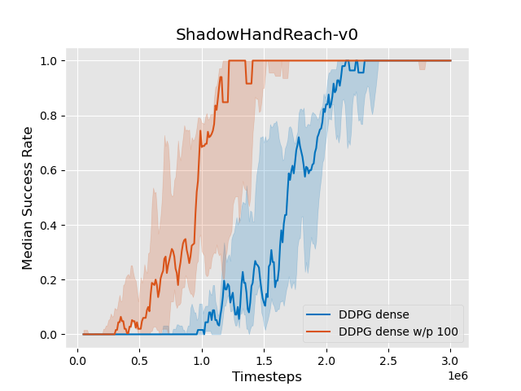 | 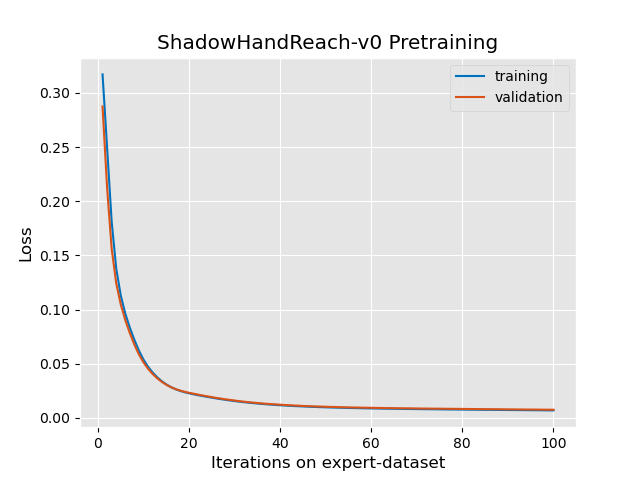|

## Shadow Hand Block

This task is much more challenging compared to the reach task. The goal is to manipulate a block in-hand to reach a target orientation within a predefined threshold (0.1 rad). The block is orientated randomly and placed in the hand’s grip. Any block center position above the hand-palm is considered valid.

The goal itself consists of the Cartesian position of the block and the target rotation represented in quaternions (7-dimensional).

Observations contain the 20 positions and velocities of the hand joints as well as the object’s Cartesian pose, linear and angular velocities and the desired target pose for [gym.Env](https://github.com/openai/gym/blob/3394e245727c1ae6851b504a50ba77c73cd4c65b/gym/core.py#L10) and gym.GoalEnv (HER).

Note: `shadow_hand_block-v0` is the same as `shadow_hand_block-v1`. Upgraded version number to match the reach environment.

| Reward | Success | Pre-training
:---:|:---:|:---:
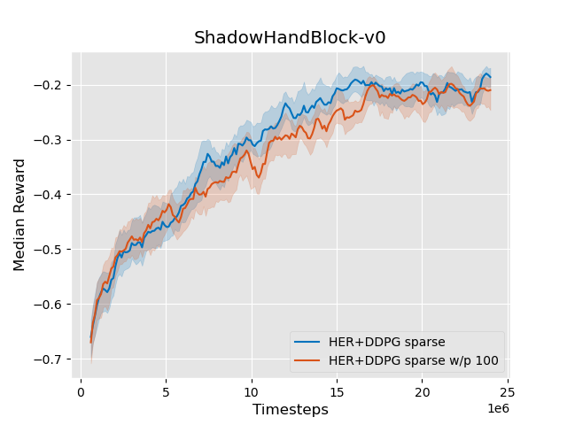 | 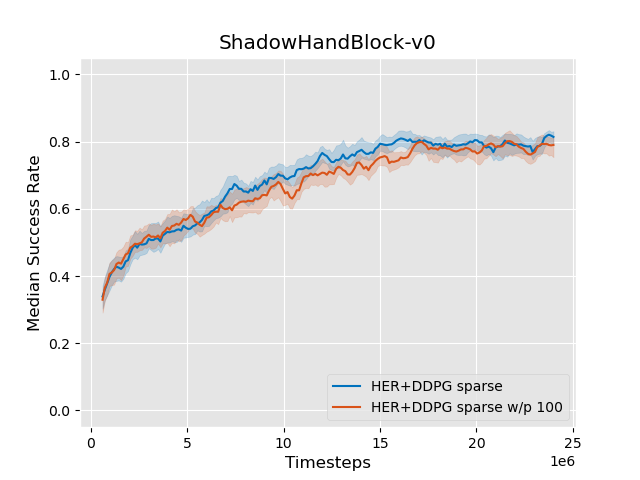 | 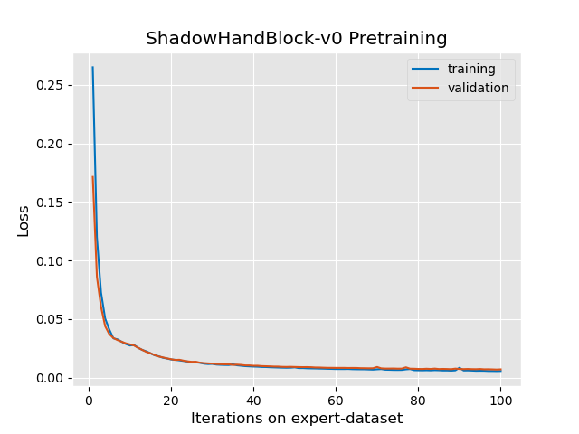|

### Visualized agents

 Untrained | Trained (HER sparse)
:---:|:---:
 | 

### Hyperparameters

The `shadow_hand_block-v0` experiment uses the following hyperparameters for HER:

| Hyperparam | Value| Hyperparam | Value| 
| :--------- | :--- | :--------- | :--- |
| Policy | Actor and critic using a MLP (3 layers of 256) | Buffer size | 1e6 transitions | 
| Discount factor (gamma) | 0.95 | Random exploration | 0 | 
| Soft update coefficient (tau) | 0.001 | Train steps | 50 | 
| Batch size | 256 | Rollout steps | 100 | 
| Critic output normalized | False | Eval steps | 100 | 
| Actor Optimizer | Adam | Noise type | normal |
| Actor learning rate | 1e-3 | Noise standard deviation | 0.22 |
| Critic Optimizer | Adam | Param noise interval | 50 (steps) |
| Critic learning rate | 1e-3 | Observation clipping | [-5.0, 5.0] |
| Total training steps | 24e6 | Goal selection strategy | future |
| Memory Limit | 1000000 | Model class | DDPG |
| N sampled goal | 4 | Random exploration | 0.3 |
| Normalize observations | False | Normalize Returns | False |

### Environment parameters

The `shadow_hand_block-v0` experiment uses the following parameters for the environment:

| Hyperparam | Value| Hyperparam | Value| 
| :--------- | :--- | :--------- | :--- |
| orientation_threshold | 0.1 | reward_type | sparse | 
| orientation_type | quaternions | max_steps_per_episode | 100 | 
| position_gain | 0.02 | couple_factor | None | 
| sim_time_step | 1 / 240 | sim_frames_skip | 10 | 
| sim_n_sub_steps | 1 | | | 

Note: `orientation_type` "6D" is still work in progress.

# Usage

To train the environments, the trainings-pipline from [stable-baselines zoo](https://github.com/araffin/rl-baselines-zoo) is used and slightly modified. Additionally an automatic pre-training process of the RL algorithm is added.  It is available with the parameter `--pretrain`.

```
  --pretrain PRETRAIN   Pretrain with expert dataset
```

Basic usage:

```
  python train.py --algo ddpg --env shadow_hand_reach-v0 --pretrain 100
```

This command will train the environment `shadow_hand_reach-v0` with a DDPG policy. 
It uses the hyperparameters specified in the corresponding hyperparamter-file (hyperparams/ddpg.yml). Additionally a pre-train sequence with 100 iterations on the current available expert dataset is performed before the actual training.  

# File structure

The file structure of this repo is mainly tied to the one used in [stable-baselines zoo](https://github.com/araffin/rl-baselines-zoo).

```
  - experts                 Expert dataset
  - gym_shadow_hand         Environments
  - hyperparams             Hyperparams for training
  - images                  Images of results and GIFs
  - logs                    Training results
  - utils                   Mainly from stable-baselines zoo
    - callback_success.py   Evalcallback with successrate logger
    - capture_output.py     Captures pretrain loss during training
  train.py                  Mainly from stable-baselines zoo, 
                            added pretraining, EvalSuccessCallback and minor changes to work with this repo
```