# Teleoperation System

## Content

* [System Structure](#system-structure)
* [Shadow Dexterous Hand Movements](#shadow-dexterous-hand-movements)
* [CyberGlove Movements](#cyberglove-movements)
* [Kinematics](#kinematics)
* [Running the simulation](#running-the-simulation)
* [Running Tests](#running-tests)
* [Getting Started](#getting-started)

## System Structure

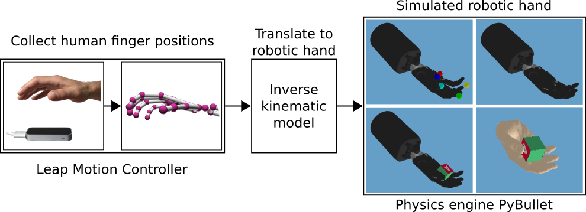

## Shadow Dexterous Hand Movements
    
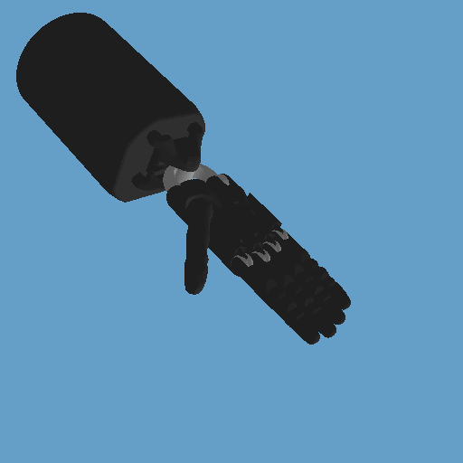

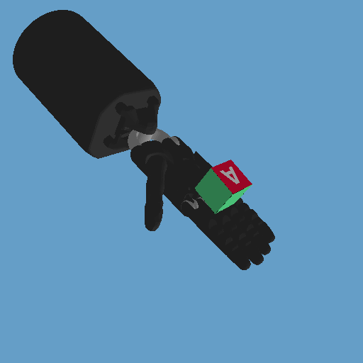

# CyberGlove Movements

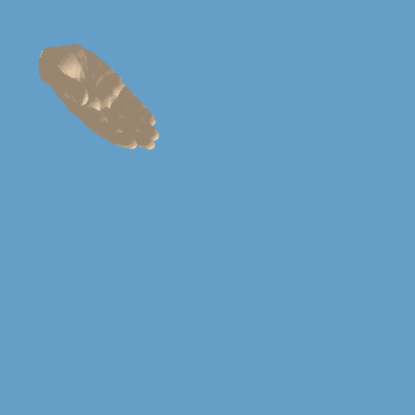

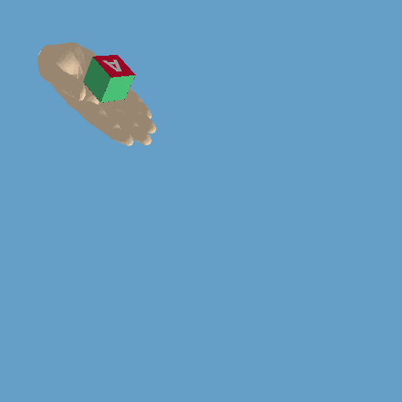

## Kinematics

The six derived inverse kinematic models are based on the following kinematic structures.

### Index, Middle, Ring and (front) Little Finger

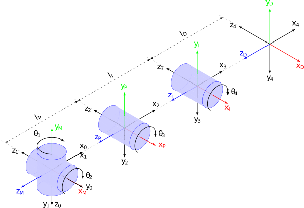

#### DH Parameter

| Joint      | _&theta;_             |   d   |   a           | _&alpha;_ | 
| ---------- |---------------------- | ----- | ------------- | --------- |
| 0 &rarr; 1 | _&theta;_<sub>1</sub> | 0     | 0             | 90°       |
| 1 &rarr; 2 | _&theta;_<sub>2</sub> | 0     | l<sub>P</sub> | 0°        |
| 2 &rarr; 3 | _&theta;_<sub>3</sub> | 0     | l<sub>I</sub> | 0°        |
| 3 &rarr; 4 | _&theta;_<sub>4</sub> | 0     | l<sub>D</sub> | 0°        |

##### _&theta;_<sub>1</sub> + _&theta;_<sub>2</sub>

```math
T_M^0 = Rot(y_M, 90°) Rot(x*, 90°)
```
```math
T_2^P = Rot(y_2, 90°) Rot(x*, 180°)
```
```math
T_M^P = T_M^0 T_0^2 T_2^P
```

##### _&theta;_<sub>3</sub>

```math
T_P^2 = Rot(y_P, 90°) Rot(x*, 180°)
```
```math
T_3^I = Rot(y_3, 90°) Rot(x*, 180°)
```
```math
T_P^I = T_P^2 T_2^3 T_3^I
```

##### _&theta;_<sub>4</sub>

```math
T_I^3 = Rot(y_I, 90°) Rot(x*, 180°)
```
```math
T_4^D = Rot(y_4, 90°) Rot(x*, 180°)
```
```math
T_I^D = T_I^3 T_3^4 T_4^D
```

### Little Finger 5

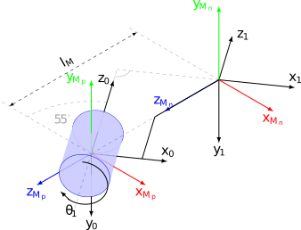

#### DH Parameter

| Joint      | _&theta;_             |   d                   |   a                   | _&alpha;_ | 
| ---------- |---------------------- | --------------------- | --------------------- | --------- |
| 0 &rarr; 1 | _&theta;_<sub>1</sub> | l<sub>M</sub>cos(35°) | l<sub>M</sub>cos(55°) | 0°        |

##### _&theta;_<sub>1</sub>

```math
T_{M_P}^0 = Rot(y_{M_P}, 35°) Rot(x*, 180°)
```
```math
T_1^{M_N} = Rot(x_1, 180°) Rot(y*, -35°)
```
```math
T_{M_P}^{M_N} = T_{M_P}^0 T_0^1 T_1^{M_N}
```

### Thumb

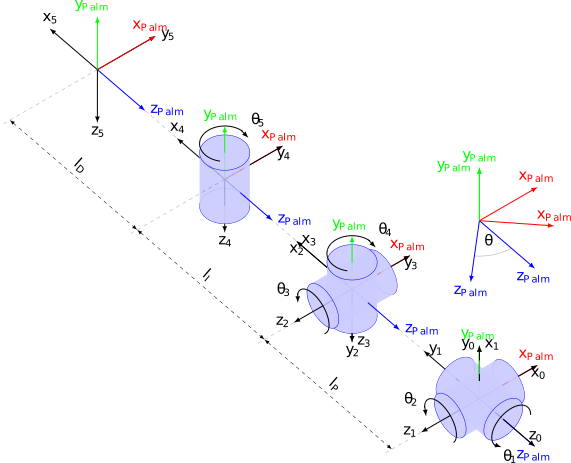

#### DH Parameter

| Joint      | _&theta;_                   |   d   |   a           | _&alpha;_ | 
| ---------- |---------------------------- | ----- | ------------- | --------- |
| 0 &rarr; 1 | _&theta;_<sub>1</sub> + 90° | 0     | 0             | -90°      |
| 1 &rarr; 2 | _&theta;_<sub>2</sub> + 90° | 0     | l<sub>P</sub> | 0°        |
| 2 &rarr; 3 | _&theta;_<sub>3</sub>       | 0     | 0             | -90°      |
| 3 &rarr; 4 | _&theta;_<sub>4</sub>       | 0     | l<sub>I</sub> | 0°        |
| 4 &rarr; 5 | _&theta;_<sub>5</sub>       | 0     | l<sub>D</sub> | 0°        |

##### _&theta;_<sub>1</sub> + _&theta;_<sub>2</sub>

```math
T_{Palm}^{Palm'} = Rot(y_{Palm, \theta})
```
```math
T_{Palm'}^0 = IdentityMatrix(4)
```
```math
T_2^{Palm''} = Rot(y_2, -90°) Rot(z*, 180°)
```
```math
T_{Palm'}^{Palm''} = T_{Palm'}^0 T_0^2 T_2^{Palm''}
```
##### _&theta;_<sub>3</sub> + _&theta;_<sub>4</sub>

```math
T_{Palm''}^2 = Rot(y_{Palm''}, 90°) Rot(x*, 180°)
```
```math
T_4^{Palm'''} = Rot(z_4, 90°) Rot(x*, -90°)
```
```math
T_{Palm''}^{Palm'''} = T_{Palm''}^2 T_2^4 T_4^{Palm'''}
```

##### _&theta;_<sub>5</sub>

```math
T_{Palm'''}^4 = Rot(y_{Palm'''}, 90°) Rot(x*, 90°)
```
```math
T_5^{Palm''''} = Rot(z_5, 90°) Rot(x*, -90°)
```
```math
T_{Palm'''}^{Palm''''} = T_{Palm'''}^4 T_4^5 T_5^{Palm'''}
```

## Running the Simulation

The simulation can be run with the following command:

```
python3 main.py
```

This starts the PyBullet environment and a listener to receive data from the Leap Motion Controller.

Optional arguments:
```
  -h, --help                        show this help message and exit
  -s SAMPLES, --samples SAMPLES     sampling mode with specified number of samples
  -o, --object                      object mode
  -r, --render                      render mode, only supports gif
  -ch, --cyber-hand                 use cyber-hand

```

## Running Tests

Before running tests test-data has to be collected. 
Collecting samples during runtime is computational inefficient and time consuming. 
Sampling/Testing mode will be enabled with one of:

```
python3 main.py -s SAMPLES
python3 main.py --samples SAMPLES
```

This will collect the first SAMPLES frames as test-data and continue normally.   

The inner core of the tests is Python's [unittest](https://docs.python.org/3/library/unittest.html) to be able to run them in a automated fashion. 
After collecting the samples, start testing.

## Position Accuracy

Checks how accurate the calculated joint angles match the real finger positions.
This starts to build up a finger from the top of the metacarpal bone corresponding to the bone lengths, directions and calculated joint angles.
Each bone top is compared to the real position and the difference is compared to zero (rounded by the given number of decimal places).
 

```
python3 -m accuracy_test
```

Additionally the test accuracy can be specified (default = 1):

```
python3 -m accuracy_test -a 3
python3 -m accuracy_test --accuracy 3
```

The accuracy parameter specifies the decimal places to be rounded to.

The output covers the the number of how many positions are within the specified accuracy as well as a visual graph in the `tests/results` directory.

### Test Results

Results are displayed exemplarly for the right hand index finger.

#### End-Position accuracy

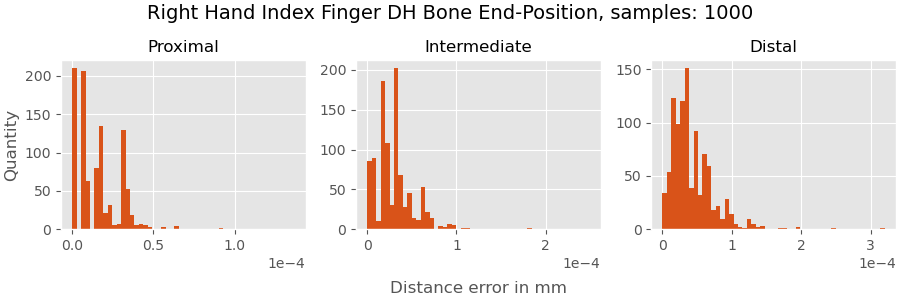

#### Direction accuracy

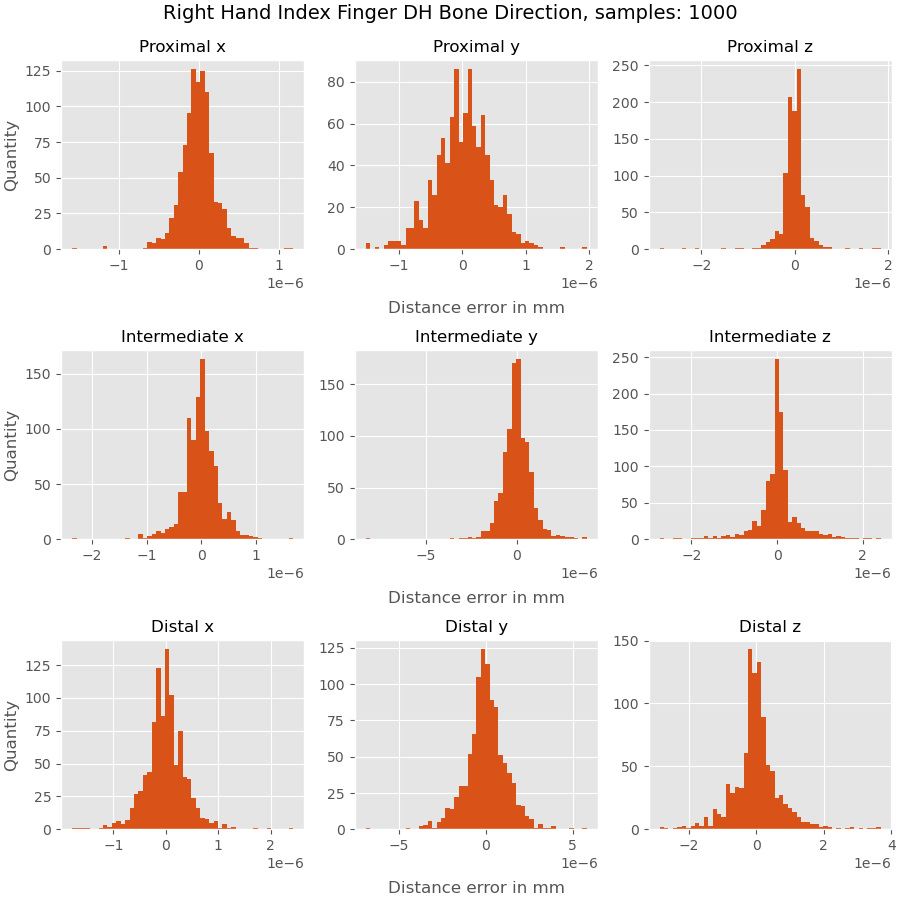

#### Direction accuracy limits

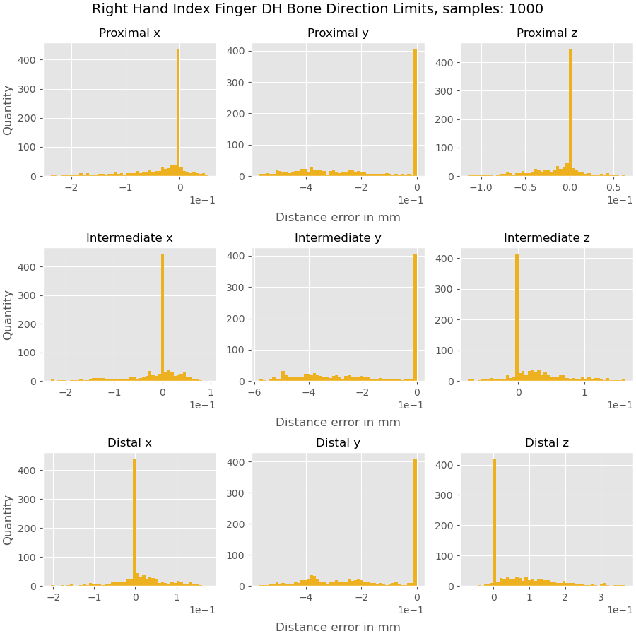

## Getting Started

These instructions will get you a copy of the project up and running on your local machine.

### Prerequisites

#### Python 3

Download and install [Python 3](https://www.python.org/).

Currently used: Python 3.7.7 (64-Bit).

Tested with: Python 3.7.4 (32-Bit) Python 3.7.7 (64-Bit) and Python 3.8.2 (64-Bit).

#### Visual Studio

Download and install [Visual Studio](https://visualstudio.microsoft.com/downloads).

#### Buildtools for Visual Studio

Download and install [Buildtools for Visual Studio](https://visualstudio.microsoft.com/downloads/).
You can either get them directly from the link or select them in the *Visual Studio Installer*.\
Make sure to choose a compiler version corresponding to your Python version (most likely 14.X or higher):

| Visual C++ | CPython                 | 
| ---------- | ----------------------- |
| 14.X       | 3.5, 3.6, 3.7, 3.8      |
| 10.0       | 3.3, 3.4                |
| 9.0        | 2.6, 2.7, 3.0, 3.1, 3.2 |

#### Leap Motion SDK

Download and extract the [Leap Motion SDK](https://developer-archive.leapmotion.com/get-started).

#### Leap Motion Control Panel

Install the Leap Motion Control Panel from within the downloaded SDK directory.

#### SWIG

Download and extract [SWIG](http://www.swig.org/).

#### Generate a Python 3 Wrapper with SWIG

The Leap Motion SDK is written in Python 2. To be able to use it with Python 3, a SWIG Wrapper has to be generated:

1.  Open Visual Studio and create an empty C++ project.
2.  Copy `Leap.h`, `LeapMath.h` and `Leap.i` from the Leap Motion SDK into this project directory and add them to the project.
3.  Copy `Leap.lib` into this project directory and add it to the project. Chose the architecture corresponding to your Python installation (x64, x86).
4.  From that directory, run SWIG to generate `LeapPython.cpp` and `LeapPython.h`:

    ```
    C:\leap_python3>"PATH-TO-YOUR-swig.exe" -c++ -python -o LeapPython.cpp -interface LeapPython Leap.i
    ```
5.  Add `LeapPython.cpp` and `LeapPython.h` to your project.

6.  Open the project properties, select Release configuration and go to the Configuration Properties -> General page.
    From there, set the `Target Name` to `LeapPython` and set the `Configuration Type` to `Dynamic Library (.dll)`.

    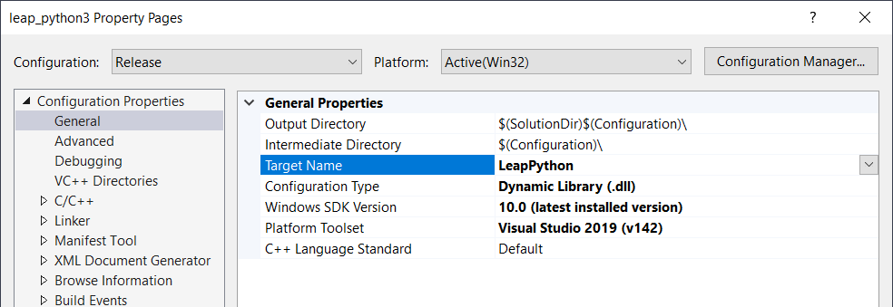
    
7.  Go to the C/C++ -> General property page and add the path containing `Python.h` (typically C:\Python3\include).

    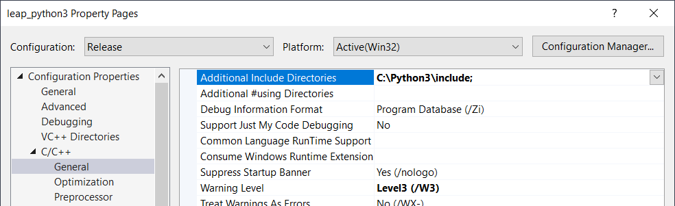  

8.  Go to the Linker -> Input property page and add `Leap.lib` and the full path to `python3.lib` (typically C:\Python3\libs\python3.lib).

    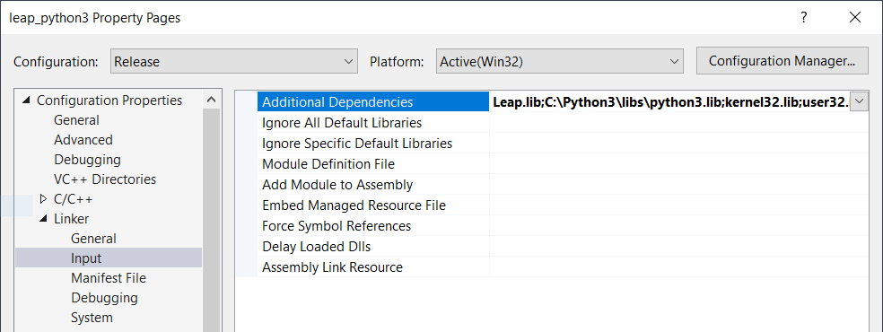
    
9.  Select Release, the corresponding architecture (x64, x86) and build the project.
10. Rename the output `LeapPython.dll` to `LeapPython.pyd`.

### Installing

#### Clone this project

Get a copy of this project by cloning it to your local machine:

```
git clone https://rgit.acin.tuwien.ac.at/matthias.hirschmanner/shadow_teleop.git
```
    
#### Add the Leap Motion SDK and the Python 3 Wrapper

1.  Use the precomiled `LeapPython.pyd` in the lower `leap_motion` directory. If that does not work, generate this file as described above and copy it in the lower `leap_motion` directory.
2.  Copy `Leap.py` from the Leap Motion SDK to the `leap_motion` directory.
3.  Copy `Leap.dll` and `Leap.lib` from the SDK to the `leap_motion` directory. 
    Make sure to chose the right architecture (x64, x86).